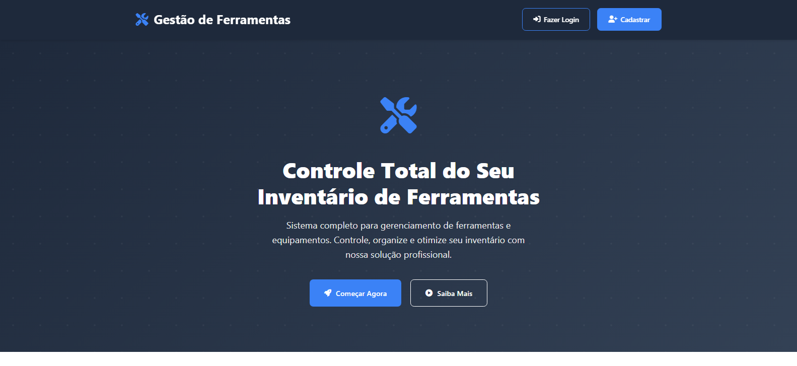
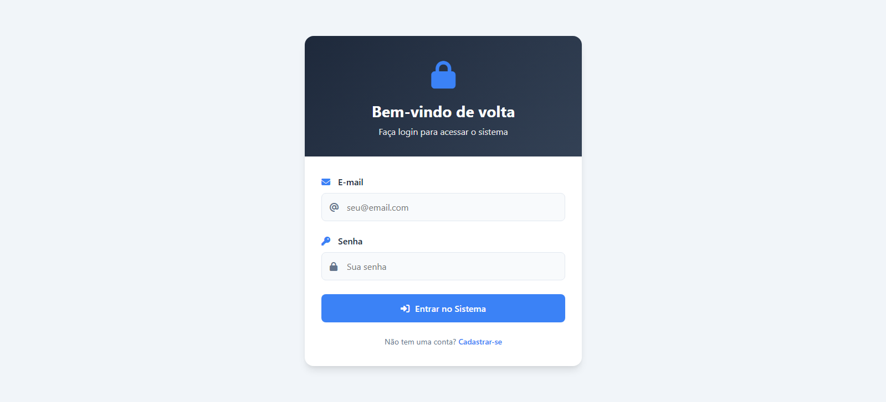
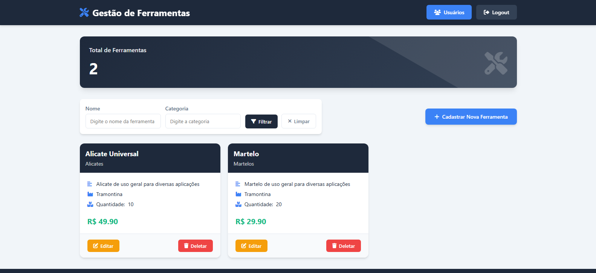
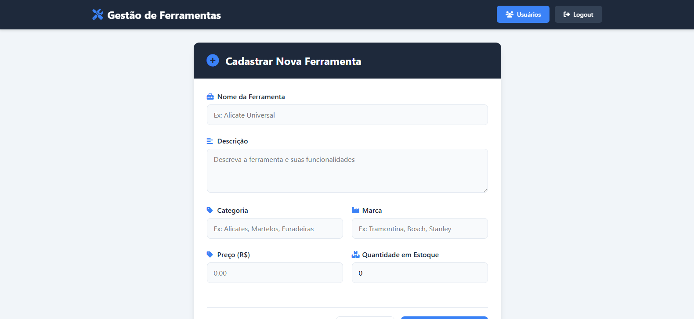
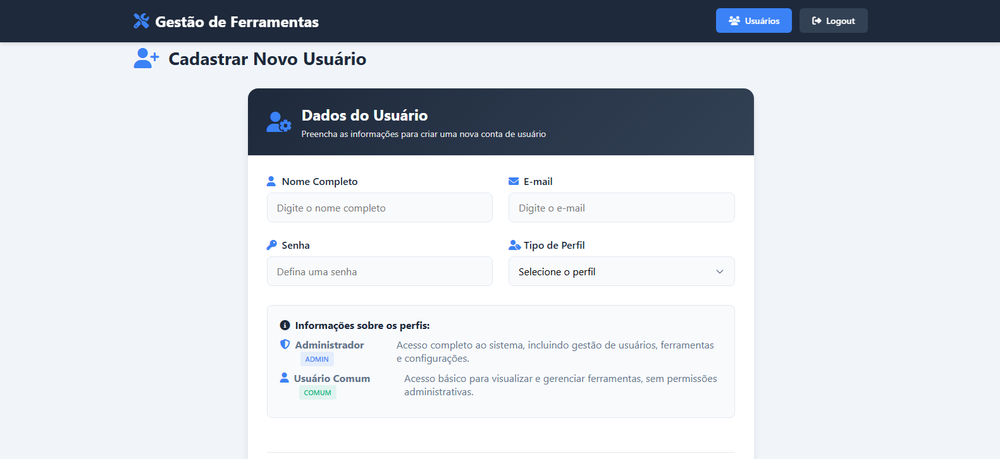

# 🛠️ CP5 Java - Gestão de Ferramentas

## 👥 Integrantes do Grupo
- **Felipe Ulson Sora** – RM555462  
- **Augusto Lopes Lyra** – RM558209
- **Vinicius Ribeiro Nery Costa** – RM559165

---

## 📖 Descrição do Projeto

O projeto **Gestão de Ferramentas** é uma aplicação web desenvolvida em **Java com o padrão MVC**, utilizando **Spring Boot**, **Thymeleaf** e **PostgreSQL** como banco de dados.  

O objetivo do sistema é permitir o **gerenciamento de ferramentas**, de forma simples, prática e segura.  

### 🔐 Tipos de Usuários

- 👤 **Usuário Comum:**  
  - Pode **visualizar** todas as ferramentas.  
  - Pode **criar e editar** ferramentas.  
  - ❌ **Não pode excluir** ferramentas.

- 🧑‍💼 **Usuário Administrador (Admin):**  
  - Pode **cadastrar, editar e excluir** usuários.  
  - Pode definir o **nível de acesso** (comum ou admin).  
  - Pode **criar, editar e excluir** ferramentas.  

O sistema já vem com um **usuário administrador padrão** para testes:
```makefile
Email: admin@email.com
Senha: admin123
```
---

## 💻 Tecnologias Utilizadas

- ☕ **Java 21**  
- 🌱 **Spring Boot 3**  
- 🔐 **Spring Security**  
- 🧩 **Thymeleaf**  
- 💾 **PostgreSQL**  
- 🧱 **JPA / Hibernate**  
- 🧰 **Lombok**  
- 🧮 **Maven**

---

## 🖼️ Prints das Telas

### 🏠 Página Inicial


### 🔑 Página de Login


### ⚙️ Página de Ferramentas


### ➕ Página de Cadastro de Ferramentas


### 👥 Página de Usuários


### 🧾 Página de Cadastro de Usuários


---

## 🚀 Como Executar o Projeto

Siga os passos abaixo para rodar o projeto localmente:

### 1️⃣ Clonar o Repositório
```bash
git clone https://github.com/seu-usuario/seu-repositorio.git
```

### 2️⃣ Configurar o Banco de Dados
- Acesse o **PostgreSQL**
- Crie um banco de dados chamado `ferramentas`:
```sql
CREATE DATABASE ferramentas;
```

- Em seguida, configure as credenciais do banco no arquivo `src/main/resources/application.properties`, por exemplo:
```properties
spring.datasource.url=jdbc:postgresql://localhost:5432/ferramentas
spring.datasource.username=postgres
spring.datasource.password=root
```

### 3️⃣ Executar o Projeto
- Abra o projeto no IntelliJ IDEA.
- Clique no ícone de play na classe principal (`@SpringBootApplication`) para iniciar o servidor.
- O projeto será iniciado no [localhost:8080](http://localhost:8080).

---

## 🌐 Deploy da Aplicação

A aplicação **Java Spring Boot MVC** foi hospedada no **Render**, juntamente com um **banco de dados PostgreSQL** também provisionado na mesma plataforma.
O deploy permite acesso público à aplicação e integração completa entre backend e banco na nuvem.

🔗 Link do Deploy: [https://cp5-mvc-java-advanced.onrender.com/](https://cp5-mvc-java-advanced.onrender.com/)

---

## 🏁 Conclusão

Este projeto foi desenvolvido como parte da **CP5 de Java**, com o objetivo de aplicar os conhecimentos em **desenvolvimento web**, **segurança**, **integração com banco de dados** e **controle de acesso**.

✨ O sistema oferece uma base sólida e extensível para futuras melhorias e novas funcionalidades.